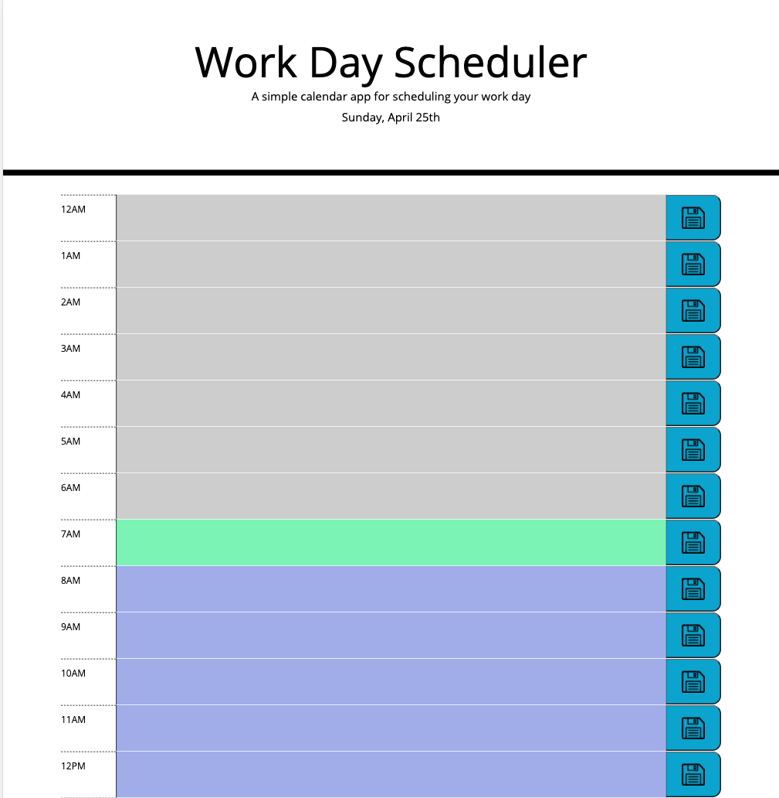

# Day_planner

## The goal:
To develop a simple calendar application that allows a user to save events for each hour of the day. The app runs in the browser and features dynamically updated HTML and CSS powered by jQuery.

To add an entry, click the text area and enter your text. Click the save button to the right to save that entry. After the reload, the entries are shown in their fields.
The fields are colored in grey, green, and violet for past, present, and future hours respectively. 

The data is saved for the day. On reload, the page will check for the date, and automatically update the fields.

[Deployed web app](https://vasylynash.github.io/Day_planner/)

